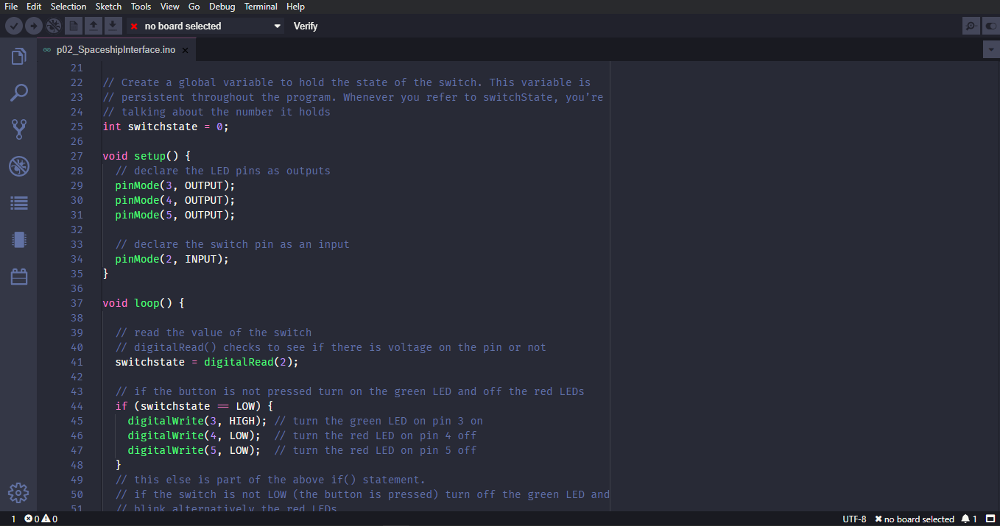

# Dracula for [Arduino Pro IDE](https://github.com/arduino/arduino-pro-ide)

> A dark theme for [Arduino Pro IDE](https://github.com/arduino/arduino-pro-ide).

## Install

All instructions can be found at [draculatheme.com/arduino-pro-ide](https://draculatheme.com/arduino-pro-ide).

## Team

This theme is maintained by the following person(s) and a bunch of [awesome contributors](https://github.com/dracula/template/graphs/contributors).

 |
--- |
[Zeno Rocha](https://github.com/zenorocha) |

## License

[MIT License](./LICENSE)